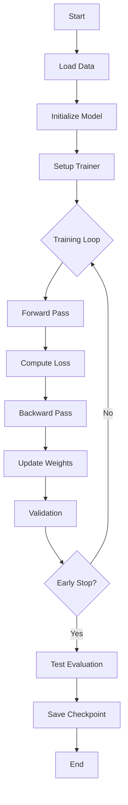

# Training Process

ChimeraLM training workflow, configuration, and checkpointing.

## Training Workflow



## Configuration with Hydra

### Configuration Structure

```yaml
# configs/train.yaml
defaults:
  - _self_
  - model: chimeralm
  - data: bam
  - trainer: default
  - logger: wandb
  - callbacks: default

trainer:
  max_epochs: 50
  accelerator: gpu
  devices: 1

model:
  optimizer:
    lr: 0.0001
    weight_decay: 0.01

data:
  batch_size: 32
  num_workers: 4
```

### Overriding Configuration

```bash
# Command-line overrides
chimeralm finetune --train-data data.bam -r model.optimizer.lr=0.001

# Multiple overrides
chimeralm finetune --train-data data.bam \
    -r model.optimizer.lr=0.001 \
    -r trainer.max_epochs=100 \
    -r data.batch_size=64
```

## Training Loop

### Epoch Structure

```python
for epoch in range(max_epochs):
    # Training phase
    model.train()
    for batch in train_loader:
        loss = training_step(batch)
        loss.backward()
        optimizer.step()

    # Validation phase
    model.eval()
    with torch.no_grad():
        for batch in val_loader:
            val_loss = validation_step(batch)

    # Checkpointing
    if val_loss < best_loss:
        save_checkpoint("best.ckpt")

    # Early stopping
    if no_improvement_for(patience=10):
        break
```

### Metrics Logged

**Training**:
- `train/loss`: Cross-entropy loss
- `train/acc`: Accuracy

**Validation**:
- `val/loss`: Validation loss
- `val/acc`: Accuracy
- `val/precision`: Precision score
- `val/recall`: Recall score
- `val/f1`: F1 score

## Checkpointing

### Checkpoint Strategy

ChimeraLM saves two types of checkpoints:

1. **Best checkpoint**: Model with lowest validation loss
2. **Last checkpoint**: Most recent model state

### Checkpoint Location

```
logs/train/runs/YYYY-MM-DD_HH-MM-SS/
├── checkpoints/
│   ├── best.ckpt        # Best model
│   └── last.ckpt        # Latest model
├── config.yaml          # Full configuration
└── tensorboard/         # TensorBoard logs
```

### Loading Checkpoints

```python
# Load for inference
model = ChimeraLM.from_pretrained("logs/.../checkpoints/best.ckpt")

# Load for continued training
trainer.fit(model, ckpt_path="logs/.../checkpoints/last.ckpt")
```

## Callbacks

### ModelCheckpoint

Saves checkpoints based on validation metrics:

```python
checkpoint_callback = ModelCheckpoint(
    monitor="val/loss",
    mode="min",
    save_top_k=1,
    filename="best"
)
```

### EarlyStopping

Stops training when validation loss stops improving:

```python
early_stop_callback = EarlyStopping(
    monitor="val/loss",
    patience=10,
    mode="min"
)
```

### PredictionWriter

Writes predictions to disk during prediction:

```python
prediction_writer = PredictionWriter(
    output_dir="predictions/",
    write_interval="batch"
)
```

## Logging

### WandB Integration

```python
# WandB logger (default)
wandb_logger = WandbLogger(
    project="chimeralm",
    name="experiment_name"
)

trainer = Trainer(logger=wandb_logger)
```

**Logged automatically**:
- Hyperparameters
- Training/validation metrics
- System metrics (GPU, memory)
- Model checkpoints

### TensorBoard

```bash
# View TensorBoard logs
tensorboard --logdir logs/train/runs/
```

## Optimization Techniques

### Mixed Precision Training

```bash
# 16-bit precision (faster on A100/H100)
chimeralm finetune --train-data data.bam -r trainer.precision=16-mixed
```

### Gradient Accumulation

```bash
# Accumulate gradients over 4 batches (simulate larger batch)
chimeralm finetune --train-data data.bam -r trainer.accumulate_grad_batches=4
```

### Gradient Clipping

```bash
# Clip gradients to prevent exploding gradients
chimeralm finetune --train-data data.bam -r trainer.gradient_clip_val=1.0
```

## Reproducibility

### Setting Seeds

```bash
# Fixed seed for reproducible results
chimeralm finetune --train-data data.bam --seed 42
```

This sets seeds for:
- Python random
- NumPy random
- PyTorch random
- CUDA random

## See Also

- [Fine-Tuning Tutorial](../tutorials/fine-tuning.md)
- [Models API Reference](../reference/models.md)
- [Architecture Overview](overview.md)
