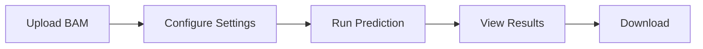

# Web UI Screenshots Guide

This document describes the screenshots needed for the Web Interface tutorial.

## Required Screenshots

### 1. web-home.png
**Location**: Home page when first opened
**What to capture**:
- Full browser window showing the landing page
- Upload area prominently visible
- Navigation menu at top
- Quick stats section (if any previous analyses exist)

**How to take**:
```bash
# Start the web interface
chimeralm web

# Navigate to http://localhost:8000
# Take screenshot of the home page
```

### 2. web-upload.png
**Location**: Upload in progress or completed
**What to capture**:
- File upload area with file selected
- Progress bar (if during upload)
- File info displayed (name, size, reads detected)
- Configure settings panel (GPU, batch size)

### 3. web-running.png
**Location**: During prediction
**What to capture**:
- Progress bar showing prediction in progress
- Current batch being processed
- Percentage complete
- Estimated time remaining
- Live log messages

**Timing**: Take screenshot when progress is around 40-60% for good visual

### 4. web-results.png
**Location**: Results dashboard after prediction completes
**What to capture**:
- Summary statistics at top (total reads, chimeric, biological, rate)
- Pie chart visualization
- Prediction table with several rows visible
- Download buttons

**Example data**: Use `mk1c_test.bam` (1000 reads, ~23% chimera rate)

### 5. web-chart.png
**Location**: Close-up of the pie chart
**What to capture**:
- Just the pie chart and legend
- Clear labels showing percentages
- Purple for chimeric, green for biological

### 6. web-table.png
**Location**: Close-up of the prediction table
**What to capture**:
- Table with read names and labels
- Column headers (Read Name, Label, Confidence)
- Sort indicators
- Search box
- Pagination controls
- At least 10-15 rows visible

### 7. web-history.png
**Location**: Results history page
**What to capture**:
- List of past analyses
- File names, dates, chimera rates
- Download links for each analysis
- Compare checkbox (if available)

### 8. web-comparison.png
**Location**: Comparison view with multiple analyses selected
**What to capture**:
- Bar chart or table comparing chimera rates
- Multiple file names
- Comparison statistics

## Screenshot Specifications

### Technical Requirements
- **Format**: PNG (preferred) or JPG
- **Resolution**: 1920x1080 or higher
- **Browser**: Chrome or Firefox (for consistency)
- **Theme**: Light mode (for documentation contrast)
- **Window**: Full browser window, no developer tools open

### Styling Tips
- Use consistent browser window size for all screenshots
- Zoom level: 100% (no zoom in/out)
- Hide bookmarks bar if present
- Crop to remove unnecessary OS taskbar/dock
- Ensure good contrast and readability

## Alternative: Using Placeholders

If the web interface is not yet implemented, you can:

1. **Use Mermaid Diagrams** to show workflow:
```markdown

```

2. **Use Mockups** created with design tools (Figma, Sketch)

3. **Add "Coming Soon" notices**:
```markdown
!!! info "Screenshot Coming Soon"
    Screenshot will be added when the web interface is available.
```

## How to Add Screenshots

Once you have the screenshots:

1. Save them in `docs/assets/screenshots/` directory
2. Reference them in the tutorial:
```markdown

```

3. Verify they display correctly:
```bash
uv run mkdocs serve
# Check each page with screenshots
```

## Creating Fake Data for Screenshots

For demo purposes with realistic data:

```bash
# Use test data
chimeralm predict tests/data/mk1c_test.bam --gpus 1

# Or create synthetic demo data
# (If the web interface needs to show multiple analyses)
```

## Notes

- All screenshots should show successful operations (no errors)
- Use the test data (`mk1c_test.bam`) for consistency
- Keep file names simple and descriptive
- Update this guide if screenshot requirements change
