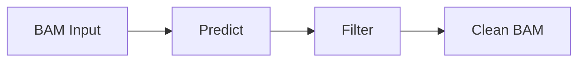

# Material Theme Features Reference

This document shows how to use the modern features enabled in ChimeraLM documentation.

## Code Blocks with Features

### With Line Numbers (automatic)
```python
def predict_chimera(bam_file):
    """Predict chimeric reads."""
    model = ChimeraLM.from_pretrained("yangliz5/chimeralm")
    return model.predict(bam_file)
```

### Inline Code
Use `chimeralm predict` for quick predictions.

## Admonitions (Collapsible)

!!! tip "Pro Tip"
    Use GPU mode for 10x faster predictions!

??? question "Need Help?"
    Click me to expand! This is a collapsible admonition.

## Tabbed Content

=== "CPU Mode"
    ```bash
    chimeralm predict input.bam --gpus 0
    ```

=== "GPU Mode"
    ```bash
    chimeralm predict input.bam --gpus 1
    ```

## Task Lists (Interactive)

- [x] Install ChimeraLM
- [x] Download sample data
- [ ] Run first prediction
- [ ] Filter BAM file

## Keyboard Keys

Press ++ctrl+c++ to stop the server.

Use ++cmd+k++ on macOS or ++ctrl+k++ on Windows.

## Advanced Typography

- **Bold text** for emphasis
- *Italic text* for terms
- ==Highlighted text== for important notes
- ~~Strikethrough~~ for deprecated features
- H~2~O for subscript
- X^2^ for superscript

## Definition Lists

`chimeralm predict`
:   Predict chimeric reads in BAM files

`chimeralm filter`
:   Filter BAM files based on predictions

## Tables with Hover

| Command | Description | GPU |
|---------|-------------|-----|
| predict | Run predictions | ✓ |
| filter  | Filter BAM | ✗ |

## Links

- [GitHub](https://github.com/ylab-hi/chimera)
- [PyPI](https://pypi.org/project/chimeralm/)

## Footnotes

ChimeraLM uses HyenaDNA[^1] for sequence modeling.

[^1]: HyenaDNA: Long-Range Genomic Sequence Modeling

## Mermaid Diagrams


